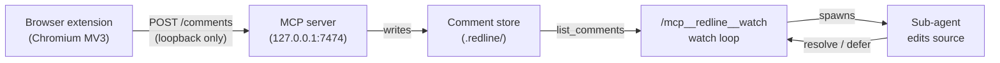

<a name="readme-top"></a>

<br />
<div align="center">
  <a href="#">
    
  </a>
  <h3 align="center">Redline</h3>

  <p align="center">
    Click any element on a running frontend, leave a comment, and let your
    AI coding assistant implement the change directly in source.
    <br />
    <br />
    <a href="https://github.com/pallandir/redline/issues">Report a bug</a>
    ·
    <a href="https://github.com/pallandir/redline/issues">Request a feature</a>
  </p>

  <p align="center">
    <a href="./LICENSE.md">
      
    </a>
    <a href="https://www.npmjs.com/package/@redline/mcp-server">
      
    </a>
    = 20">
    
  </p>
</div>

## Table of contents

- [What is Redline](#what-is-redline)
- [How it works](#how-it-works)
- [Prerequisites](#prerequisites)
- [Getting started](#getting-started)
- [Usage](#usage)
- [Uninstall](#uninstall)
- [Source mapping](#source-mapping)
- [Compatibility](#compatibility)
- [FAQ](#faq)
- [Security and privacy](#security-and-privacy)
- [License](#license)

<p align="right">(<a href="#readme-top">back to top</a>)</p>

## What is Redline

**Redline** is a Chromium extension paired with an MCP server. Click any element
on a running frontend, local or a remote preview, leave a structured comment
anchored to it, and have your AI coding assistant pick up the list and implement
the changes directly against your real source files. Nothing is sent to a remote
backend; every comment travels over loopback between the browser and a server
running on your own machine.

### Why "Redline"?

In editorial, architectural, and engineering practice, "redlining" means marking
up a draft in red ink with the corrections that must be made before it ships.
That is exactly what this tool does to a running UI: you redline the interface,
and the assistant closes the marks.

<p align="right">(<a href="#readme-top">back to top</a>)</p>

## How it works



The extension activates per-tab when you click its toolbar icon. Each saved item
carries a stable selector, visible text, computed styles, a cropped screenshot,
and, when available, a precise `file:line:column` from a framework inspector
plugin. On a `localhost` dev server the extension sends those comments directly
to the MCP server running in your project. In Claude Code, you paste the watch
command from the toolbar and the MCP server binds the session, watches for new
batches, and dispatches a sub-agent to implement each one with no approval step.
Comments that need deeper thought are parked for later; a notice appears in the
browser toolbar.

For a deeper look at the architecture and the message flows, see the
[docs folder](./docs).

<p align="right">(<a href="#readme-top">back to top</a>)</p>

## Prerequisites

| Need | Why | Required? |
|---|---|---|
| Node 20+ | runs the MCP server via `npx` | Yes |
| [Claude Code](https://claude.ai/code) | plugin host and watch loop | Yes |
| Chromium browser (Chrome, Edge, Brave, Arc) | extension | Yes |
| Framework inspector plugin | precise `file:line:column` mapping | Optional |
| [`redline-design-score` skill](./plugin/skills/redline-design-score/SKILL.md) | purpose-fit page scoring, bundled with the plugin | Optional |

<p align="right">(<a href="#readme-top">back to top</a>)</p>

## Getting started

Four steps, nothing to clone or build. The plugin updates itself through Claude
Code and the extension updates itself from the store.

### Step 1: Install the MCP server

In Claude Code, run these two commands. They register the MCP server (launched
on demand via `npx`) and the bundled design-scoring skill:

```
/plugin marketplace add pallandir/redline
/plugin install redline@redline
```

### Step 2: Install the browser extension

The extension is required, it is what captures your comments on the page.
Install Redline from the Chrome Web Store and pin it to your toolbar. It runs in
any Chromium browser (Chrome, Edge, Brave, Arc).

[**Add to Chrome →**](https://chrome.google.com/webstore) *(store listing coming soon)*

### Step 3: Connect the extension to your assistant

Open your frontend on a `localhost` dev server, with Claude Code running in the
same repo, and click the Redline toolbar icon to activate it on that tab. Copy
the `/mcp__redline__watch <id>` command from the toolbar and paste it into Claude
Code. The session binds and Redline starts watching for comments.

### Step 4: Start commenting

Mark up the page with the toolbar tools, then click **Send to AI**. Each batch
you send is implemented directly in your source by the watch loop. See
[Usage](#usage) for the full tour.

> [!IMPORTANT]
> The comment store (`.redline/design-comments.md`) and screenshots
> (`.redline/design-shots/`) are written to the project root where Claude Code is
> open and are gitignored. Keep them out of version control.

<p align="right">(<a href="#readme-top">back to top</a>)</p>

## Usage

1. **Run your frontend** on a `localhost` dev server (or open a remote preview).
   Open Claude Code in the repo whose source you want to edit. Launching Claude
   starts the Redline MCP server, which opens a listener on `127.0.0.1:7474`
   (falling back to 7475, then 7476).

2. **Click the Redline toolbar icon** to activate it on the current tab. This
   is the only moment Redline gains page access; the access ends when the tab
   navigates. A draggable Figma-style toolbar appears.

3. **Leave comments** with the four tools: **Select** to inspect an element,
   **Comment** to leave a note, **Color** to change text or background color
   live, **Text** to edit copy inline. Each saved item is pinned to its element
   and listed in the toolbar drawer.

4. **Send to your assistant.** On `localhost`, items queue locally and clicking
   **Send to AI** flushes the batch to the MCP server, waking the watch loop.
   On a remote preview there is no local project, so use **Handoff** to download
   a Markdown report for any assistant.

5. **Copy the watch command** from the toolbar or popup (the Copy button writes
   the full `/mcp__redline__watch <id>` command; the display shows only the
   short id for readability). Paste it into Claude Code. The MCP `watch` prompt
   binds the session and starts watching: each time you send a batch it
   implements the comments directly via a sub-agent, then marks them resolved.
   Comments that need more thought (new dependencies, cross-cutting changes, or
   anything you flag "Plan this first") are parked in
   `.redline/redline-deferred.md` and a notice appears in the toolbar.

With any other MCP client, call `bind_session`, `wait_for_update`, and
`list_comments` directly.

<p align="right">(<a href="#readme-top">back to top</a>)</p>

## Uninstall

Removing Redline is three independent steps; do the ones that apply to you.

1. **Remove the browser extension.** Open `chrome://extensions`, find the
   Redline card, and click **Remove**. In Firefox-family builds, use
   `about:addons`. This also clears the extension's local queue and stored
   session token.

2. **Uninstall the Claude Code plugin.**

   ```
   /plugin uninstall redline
   /plugin marketplace remove pallandir/redline
   ```

   If you registered the MCP server directly instead of through the plugin,
   remove that registration:

   ```sh
   claude mcp remove redline
   ```

3. **Delete the local comment store.** The server writes everything into a
   gitignored `.redline/` folder at your project root. Delete it to remove all
   comments, deferrals, ratings, and screenshots:

   ```sh
   rm -rf .redline
   ```

   Nothing lives outside your machine, so there is no account or remote data to
   clean up.

<p align="right">(<a href="#readme-top">back to top</a>)</p>

## Source mapping

Comments always carry a selector, element text, and bounding rect so the
assistant can locate the code by search. When the page's dev build exposes an
inspector data attribute, comments also carry a precise `file:line:column`.

Add the matching plugin to your dev build to enable this:

| Framework | Plugin | Notes |
|---|---|---|
| React / Next.js | [`react-dev-inspector`](https://github.com/zthxxx/react-dev-inspector) | |
| Vue / Nuxt | [`vite-plugin-vue-inspector`](https://github.com/webfansplz/vite-plugin-vue-inspector) | Set `Inspector({ cleanHtml: false })`. The default strips `data-v-inspector` from the DOM, so Redline cannot read it. |
| Svelte / SvelteKit | Svelte Inspector (built into `@sveltejs/vite-plugin-svelte`) | |

<p align="right">(<a href="#readme-top">back to top</a>)</p>

## Compatibility

Redline's MCP server speaks standard MCP over stdio and works with any
MCP-capable AI coding assistant. It has been **tested with Claude Code**; other
clients (Cursor, Windsurf, and similar) should work but are currently
unverified.

The extension targets **Chromium Manifest V3**: Chrome, Edge, Brave, and Arc. A
Firefox port is not yet available.

### MCP tools

The server exposes 11 tools that any MCP client can call directly:

| Tool | Purpose |
|---|---|
| `list_comments` | List comments, optionally filtered by status (`open`, `resolved`, `wontfix`) |
| `wait_for_update` | Long-poll until the store changes; heartbeats the session binding |
| `bind_session` | Claim ownership of comment processing for this session |
| `unbind_session` | Release ownership so another session can take over |
| `defer_comment` | Park a comment for planning and notify the browser toolbar |
| `list_deferred` | List comments that were deferred with their reasons |
| `resolve_comment` | Set the status of a single comment |
| `resolve_comments` | Batch-resolve multiple comments in one call |
| `list_rating_requests` | List pending or scored page rating requests |
| `submit_rating` | Submit an Awwwards-style score for a rating request |
| `clear_resolved` | Remove all non-open comments from the store |

<p align="right">(<a href="#readme-top">back to top</a>)</p>

## FAQ

**I sent comments but the assistant never picked them up.**
Comments only leave the browser when you click **Send to AI** in the toolbar.
**Save** enqueues a comment locally, **Send** flushes the batch to the server and
wakes the watch loop. Make sure you also pasted the `/mcp__redline__watch <id>`
command into Claude Code so a session is bound and watching.

**The extension says it cannot reach the server.**
The server listens on loopback only, so the page you are commenting on must be a
`localhost` or `127.0.0.1` dev server, and Claude Code must be open in the
project (launching Claude starts the server). On a remote preview there is no
local project to edit, so Redline keeps comments in the browser and you export
them with **Handoff** instead.

**Port 7474 is already in use.**
The server automatically falls back to 7475, then 7476, and the extension probes
the same range, so a busy port usually just works. To pin a specific port, set
`REDLINE_PORT` in the environment where Claude Code launches the server.

**Can two projects run Redline at once?**
Not in v1. One project binds the port and the session at a time. Set a different
`REDLINE_PORT` per project if you need to switch between them.

**Where is my data stored, and does anything leave my machine?**
Everything stays local. Queued comments live in the browser's `chrome.storage`;
once sent, they are written to a gitignored `.redline/` folder at your project
root. Nothing is sent to any remote server, and there is no analytics or
telemetry. See [PRIVACY.md](./PRIVACY.md).

**When will the extension be on the Chrome Web Store?**
The store listing is prepared and the release is coming soon. The
[Getting started](#getting-started) section links to it.

**How do I report a security issue?**
Please do not open a public issue. Use a
[GitHub security advisory](https://github.com/pallandir/redline/security/advisories/new).
Full details are in [SECURITY.md](./SECURITY.md).

<p align="right">(<a href="#readme-top">back to top</a>)</p>

## Security and privacy

Everything stays on your machine. The MCP server binds to `127.0.0.1` only and
rejects any request whose `Host` header is not loopback (anti-DNS rebinding) or
whose `Origin` is not a browser extension origin (blocking CSRF from web pages).
The extension's only network access is that loopback listener; it has no standing
access to any page. `activeTab` grants access to one tab for as long as it stays
on the current URL, and that access is revoked on navigation.

See [SECURITY.md](./SECURITY.md) for the full threat model and
[PRIVACY.md](./PRIVACY.md) for data handling details.

<p align="right">(<a href="#readme-top">back to top</a>)</p>

## License

This repository is under the **PolyForm Noncommercial License 1.0.0**. You may
use, modify, and share it for noncommercial purposes. All commercial rights are
reserved by the copyright holder. See [LICENSE.md](./LICENSE.md) for the full
terms and commercial licensing contact.

<p align="right">(<a href="#readme-top">back to top</a>)</p>
