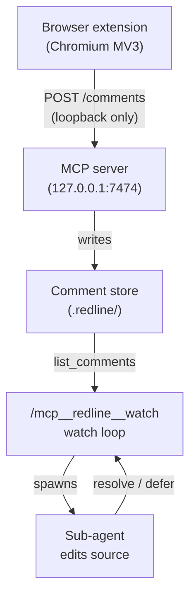

<a name="readme-top"></a>

<br />
<div align="center">
  <a href="#">
    
  </a>
  <h3 align="center">Redline</h3>

  <p align="center">
    Click any element on a running frontend, leave a comment, and let your
    AI coding assistant implement the change directly in source.
    <br />
    <br />
    <a href="https://github.com/pallandir/redline/issues">Report a bug</a>
    ·
    <a href="https://github.com/pallandir/redline/issues">Request a feature</a>
  </p>

  <p align="center">
    <a href="./LICENSE.md">
      
    </a>
    <a href="https://www.npmjs.com/package/@redline/mcp-server">
      
    </a>
    = 20">
    
  </p>
</div>

## Table of contents

- [What is Redline](#what-is-redline)
- [How it works](#how-it-works)
- [Prerequisites](#prerequisites)
- [Getting started](#getting-started)
- [Usage](#usage)
- [Source mapping](#source-mapping)
- [Compatibility](#compatibility)
- [FAQ](#faq)
- [Security and privacy](#security-and-privacy)
- [Uninstall](#uninstall)
- [License](#license)

<p align="right">(<a href="#readme-top">back to top</a>)</p>

## What is Redline

**Redline** is a Chromium extension paired with an MCP server. Click any element
on a running frontend, local or a remote preview, leave a structured comment
anchored to it, and have your AI coding assistant pick up the list and implement
the changes directly against your real source files. Nothing is sent to a remote
backend; every comment travels over loopback between the browser and a server
running on your own machine.

### Why "Redline"?

In editorial, architectural, and engineering practice, "redlining" means marking
up a draft in red ink with the corrections that must be made before it ships.
That is exactly what this tool does to a running UI: you redline the interface,
and the assistant closes the marks.

<p align="right">(<a href="#readme-top">back to top</a>)</p>

## How it works



The extension activates per-tab when you click its toolbar icon. Each saved item
carries a stable selector, visible text, computed styles, a cropped screenshot,
and a precise `file:line:column` from the framework inspector plugin that
anchors every edit to the right source location. On a `localhost` dev server the
extension sends those comments directly to the MCP server running in your
project. Your MCP client binds the session, watches for new batches, and applies
each one against your real source files. Comments that need deeper thought are
parked for later; a notice appears in the browser toolbar.

For a deeper look at the architecture and the message flows, see the
[docs folder](./docs).

<p align="right">(<a href="#readme-top">back to top</a>)</p>

## Prerequisites

| Need | Why | Required? |
|---|---|---|
| Node 20+ | runs the MCP server via `npx` | Yes |
| An MCP-capable AI coding assistant | reads comments and edits your source (Claude Code, Cursor, Windsurf, or any MCP client) | Yes |
| Chromium browser (Chrome, Edge, Brave, Arc) | extension | Yes |
| Framework inspector plugin | precise `file:line:column` mapping | Yes |
| [`redline-design-score` skill](./plugin/skills/redline-design-score/SKILL.md) | purpose-fit page scoring | Optional |

<p align="right">(<a href="#readme-top">back to top</a>)</p>

## Getting started

Four steps, nothing to clone or build. The MCP server is launched on demand via
`npx`, and the extension updates itself from the store.

### Step 1 · Register the MCP server

Add `@redline/mcp-server` to your assistant's MCP configuration. Any MCP-capable
client can launch it on demand via `npx`:

```json
{
  "mcpServers": {
    "redline": {
      "command": "npx",
      "args": ["-y", "@redline/mcp-server"]
    }
  }
}
```

> [!TIP]
> In Claude Code, register it from the CLI instead:
> ```sh
> claude mcp add redline -- npx -y @redline/mcp-server
> ```

---

### Step 2 · Install the browser extension

The extension is required, it is what captures your comments on the page.
Install Redline from the Chrome Web Store and pin it to your toolbar. It runs in
any Chromium browser (Chrome, Edge, Brave, Arc).

[**Add to Chrome →**](https://chrome.google.com/webstore) *(store listing coming soon)*

---

### Step 3 · Connect the extension to your assistant

Open your frontend on a `localhost` dev server, with your assistant running in
the same repo, and click the Redline toolbar icon to activate it on that tab.
Copy the session id from the toolbar and have your assistant call `bind_session`
with it. The session binds and Redline starts watching for comments.

> [!TIP]
> In Claude Code, the toolbar's Copy button gives you a ready-made
> `/mcp__redline__watch <id>` command. Paste it in and Claude binds the session
> and drives the watch loop automatically.

---

### Step 4 · Start commenting

Mark up the page with the toolbar tools, then click **Send to AI**. Each batch
you send is applied directly to your source by your assistant. See
[Usage](#usage) for the full tour.

> [!IMPORTANT]
> The comment store (`.redline/design-comments.md`) and screenshots
> (`.redline/design-shots/`) are written to the project root where your MCP
> client is running and are gitignored. Keep them out of version control.

<p align="right">(<a href="#readme-top">back to top</a>)</p>

## Usage

Redline runs in two modes depending on where your frontend lives.

### Online · localhost dev server

Comments flow live to your assistant over loopback and are applied to your
source as you send them.

1. **Run your frontend** on a `localhost` dev server. Start your MCP client in
   the repo whose source you want to edit; it launches the Redline MCP server,
   which opens a listener on `127.0.0.1:7474` (falling back to 7475, then 7476).

2. **Click the Redline toolbar icon** to activate it on the current tab. This
   is the only moment Redline gains page access; the access ends when the tab
   navigates. A draggable Figma-style toolbar appears.

3. **Leave comments** with the four tools: **Select** to inspect an element,
   **Comment** to leave a note, **Color** to change text or background color
   live, **Text** to edit copy inline. Each saved item is pinned to its element
   and listed in the toolbar drawer.

4. **Bind the session.** Copy the session id from the toolbar and have your
   assistant call `bind_session` with it so Redline starts watching.

5. **Send to AI.** Items queue locally; clicking **Send to AI** flushes the
   batch to the MCP server. Your assistant applies each comment directly to your
   source, then marks it resolved. Comments that need more thought (new
   dependencies, cross-cutting changes, or anything you flag "Plan this first")
   are parked in `.redline/redline-deferred.md` and a notice appears in the
   toolbar.

With any MCP client, drive the loop directly with the raw tools: `bind_session`,
`wait_for_update`, and `list_comments`.

> [!TIP]
> In Claude Code, the `/mcp__redline__watch <id>` prompt binds the session and
> runs the watch loop for you, dispatching a sub-agent per batch with no
> approval step.

### Offline · remote preview or no local project

There is no local server to reach, so you export the batch and hand it to any
assistant.

1. **Open the remote preview** and click the Redline toolbar icon to activate it.

2. **Leave comments** the same way as online.

3. **Handoff.** Click **Handoff** to download a Markdown report of the batch.
   Give that report to any AI coding assistant to implement the changes.

<p align="right">(<a href="#readme-top">back to top</a>)</p>

## Source mapping

Comments carry a selector, element text, and bounding rect as a coarse anchor,
and a precise `file:line:column` from the framework inspector data attribute
your dev build exposes. That precise location is what lets the assistant edit
the exact source that renders each element.

Add the matching plugin to your dev build:

| Framework | Plugin | Notes |
|---|---|---|
| React / Next.js | [`react-dev-inspector`](https://github.com/zthxxx/react-dev-inspector) | |
| Vue / Nuxt | [`vite-plugin-vue-inspector`](https://github.com/webfansplz/vite-plugin-vue-inspector) | Set `Inspector({ cleanHtml: false })`. The default strips `data-v-inspector` from the DOM, so Redline cannot read it. |
| Svelte / SvelteKit | Svelte Inspector (built into `@sveltejs/vite-plugin-svelte`) | |

<p align="right">(<a href="#readme-top">back to top</a>)</p>

## Compatibility

Redline's MCP server speaks standard MCP over stdio and works with any
MCP-capable AI coding assistant, Claude Code, Cursor, Windsurf, and similar
clients all connect the same way. Any client that can call the tools below can
drive the full flow.

The extension targets **Chromium Manifest V3**: Chrome, Edge, Brave, and Arc. A
Firefox port is not yet available.

### MCP tools

The server exposes 11 tools that any MCP client can call directly:

| Tool | Purpose |
|---|---|
| `list_comments` | List comments, optionally filtered by status (`open`, `resolved`, `wontfix`) |
| `wait_for_update` | Long-poll until the store changes; heartbeats the session binding |
| `bind_session` | Claim ownership of comment processing for this session |
| `unbind_session` | Release ownership so another session can take over |
| `defer_comment` | Park a comment for planning and notify the browser toolbar |
| `list_deferred` | List comments that were deferred with their reasons |
| `resolve_comment` | Set the status of a single comment |
| `resolve_comments` | Batch-resolve multiple comments in one call |
| `list_rating_requests` | List pending or scored page rating requests |
| `submit_rating` | Submit an Awwwards-style score for a rating request |
| `clear_resolved` | Remove all non-open comments from the store |

<p align="right">(<a href="#readme-top">back to top</a>)</p>

## FAQ

**I sent comments but the assistant never picked them up.**
Comments only leave the browser when you click **Send to AI** in the toolbar.
**Save** enqueues a comment locally, **Send** flushes the batch to the server.
Make sure your assistant has bound the session (via `bind_session`, or the
`/mcp__redline__watch <id>` prompt in Claude Code) so it is watching.

**The extension says it cannot reach the server.**
The server listens on loopback only, so the page you are commenting on must be a
`localhost` or `127.0.0.1` dev server, and your MCP client must be running in the
project (starting the client launches the server). On a remote preview there is
no local project to edit, so Redline keeps comments in the browser and you export
them with **Handoff** instead.

**Port 7474 is already in use.**
The server automatically falls back to 7475, then 7476, and the extension probes
the same range, so a busy port usually just works. To pin a specific port, set
`REDLINE_PORT` in the environment where your client launches the server.

**Can two projects run Redline at once?**
Not in v1. One project binds the port and the session at a time. Set a different
`REDLINE_PORT` per project if you need to switch between them.

**Where is my data stored, and does anything leave my machine?**
Everything stays local. Queued comments live in the browser's `chrome.storage`;
once sent, they are written to a gitignored `.redline/` folder at your project
root. Nothing is sent to any remote server, and there is no analytics or
telemetry. See [PRIVACY.md](./PRIVACY.md).

**When will the extension be on the Chrome Web Store?**
The store listing is prepared and the release is coming soon. The
[Getting started](#getting-started) section links to it.

**How do I report a security issue?**
Please do not open a public issue. Use a
[GitHub security advisory](https://github.com/pallandir/redline/security/advisories/new).
Full details are in [SECURITY.md](./SECURITY.md).

<p align="right">(<a href="#readme-top">back to top</a>)</p>

## Security and privacy

Everything stays on your machine. The MCP server binds to `127.0.0.1` only and
rejects any request whose `Host` header is not loopback (anti-DNS rebinding) or
whose `Origin` is not a browser extension origin (blocking CSRF from web pages).
The extension's only network access is that loopback listener; it has no standing
access to any page. `activeTab` grants access to one tab for as long as it stays
on the current URL, and that access is revoked on navigation.

See [SECURITY.md](./SECURITY.md) for the full threat model and
[PRIVACY.md](./PRIVACY.md) for data handling details.

<p align="right">(<a href="#readme-top">back to top</a>)</p>

## Uninstall

Removing Redline is three independent steps; do the ones that apply to you.

1. **Remove the browser extension.** Open `chrome://extensions`, find the
   Redline card, and click **Remove**. In Firefox-family builds, use
   `about:addons`. This also clears the extension's local queue and stored
   session token.

2. **Remove the MCP server registration.** Delete the `redline` entry from your
   assistant's MCP configuration.

   > [!TIP]
   > In Claude Code, remove it from the CLI:
   > ```sh
   > claude mcp remove redline
   > ```

3. **Delete the local comment store.** The server writes everything into a
   gitignored `.redline/` folder at your project root. Delete it to remove all
   comments, deferrals, ratings, and screenshots:

   ```sh
   rm -rf .redline
   ```

   Nothing lives outside your machine, so there is no account or remote data to
   clean up.

<p align="right">(<a href="#readme-top">back to top</a>)</p>

## License

This repository is under the **PolyForm Noncommercial License 1.0.0**. You may
use, modify, and share it for noncommercial purposes. All commercial rights are
reserved by the copyright holder. See [LICENSE.md](./LICENSE.md) for the full
terms and commercial licensing contact.

<p align="right">(<a href="#readme-top">back to top</a>)</p>
