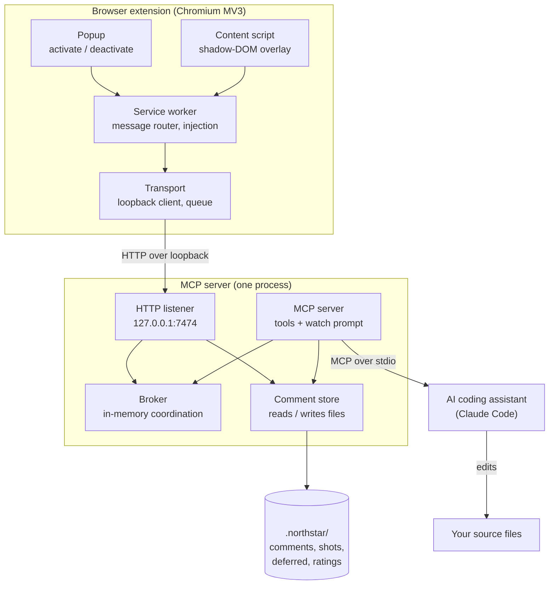
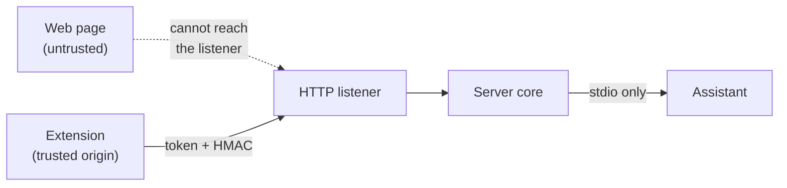

# Architecture

Northstar is two shipped artifacts (a browser extension and an MCP server) plus the
AI assistant that drives them and the on-disk store they share. The extension and
the assistant never talk directly; the MCP server sits in the middle and bridges
two transports, HTTP on one side and MCP over stdio on the other.

## Component map

## What each component owns

### Browser extension

- **Popup** is the on and off switch. It reads the active tab's state and asks the
  service worker to inject or tear down the overlay.
- **Service worker** is the extension's hub. It routes messages, verifies that
  every message came from this extension, injects the content script on demand
  under the `activeTab` grant, and delegates all networking to the transport
  layer. There is no standing content script, so no page is touched until you
  activate it.
- **Content script** renders the whole UI inside a closed shadow DOM so page
  styles cannot leak in or out. It draws the draggable toolbar (Select, Comment,
  Color, Text), the hover and selection boxes, pins, the composer, and the
  drawer. It also captures the element fingerprint and reads inspector attributes
  for source mapping.
- **Transport** is the only part that touches the network or storage. It
  discovers the server across the loopback port range, runs the HMAC handshake,
  holds the comment queue in `chrome.storage`, and flushes batches on Send.

### MCP server

One process exposes two faces at once.

- **HTTP listener** is the extension's entry point. It binds to `127.0.0.1`
  only, checks the Origin and Host of every request, requires the session bearer
  token, and validates each payload against a strict schema before handing it to
  the store.
- **MCP server** is the assistant's entry point. It speaks MCP over stdio,
  registers the watch prompt and the eleven tools, and carries the instructions
  that tell the assistant how to run the loop and to treat comment text as data,
  never as instructions.
- **Broker** is the shared in-memory state that lets the two faces coordinate: a
  version counter that bumps when the store changes, the set of long-poll waiters
  it wakes, the session binding and token, and extension liveness heartbeats.
- **Comment store** owns the files. It serializes and parses the markdown and
  JSON stores, writes screenshots with server-generated names, and keeps every
  path confined under the project root.

### Shared store

Everything the server persists lives under a single gitignored `.northstar/` folder
at the project root: the comment store (`design-comments.md` and `.json`), the
cropped screenshots (`design-shots/`), the deferred list, and the ratings file.
The server also writes a `.gitignore` inside that folder so it can never be
committed by accident.

### AI assistant

The assistant is the only component that changes your code. It connects over
stdio, runs the watch loop, and dispatches a sub-agent per batch to locate and
edit the real source files, then reports each comment as resolved or deferred.

## Trust boundaries

Two boundaries matter. The first is between any web page you happen to be visiting
and the listener: the page cannot reach it, because the listener rejects
non-extension Origins and non-loopback Hosts and requires a token the page never
sees. The second is between the network side and the assistant: the session token
is delivered only over the trusted stdio channel, never over HTTP, so a rogue
local process cannot impersonate a paired session. The full model is in
[SECURITY.md](../SECURITY.md).
