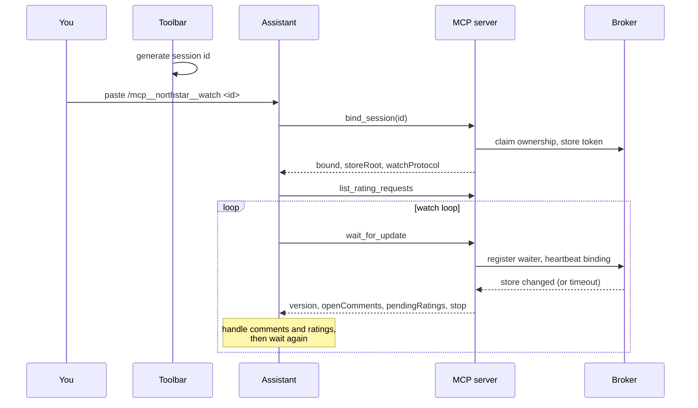
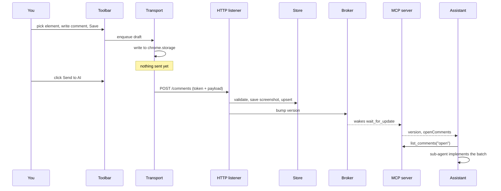
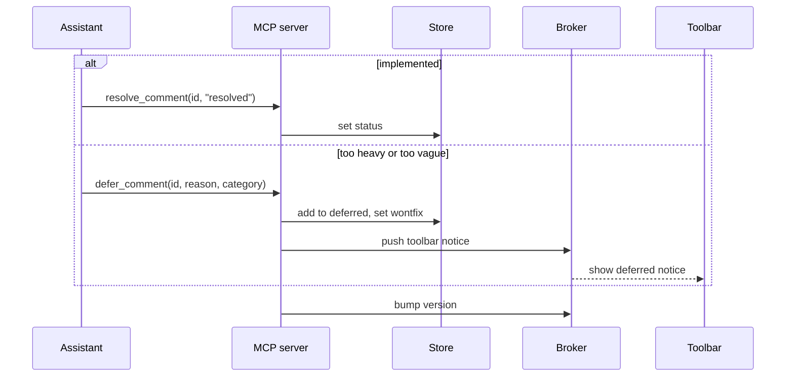
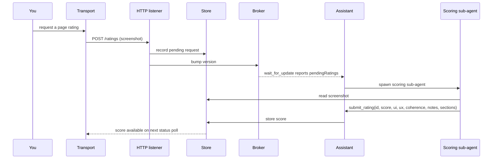

# Flows

These sequence diagrams show the message order for the four things Northstar does:
pairing a session and watching, sending a batch, resolving or deferring work, and
scoring a page. The participants are the toolbar (in the content script), the
extension transport layer, the server's HTTP listener, the broker, the comment
store, and the AI assistant.

## 1. Pair a session and enter the watch loop

Pairing starts in the browser, which shows a session id. You paste the watch
command into the assistant. The id is the credential: the assistant claims it over
stdio, and the extension proves it over loopback.

The loop only ends when `wait_for_update` reports `stop: true` (the extension
disconnected) or you ask the assistant to stop. Either way it calls
`unbind_session` so the toolbar flips out of watching straight away.

## 2. Capture a comment and send the batch

Saving a comment is local and instant. Sending is the moment data crosses to the
server and wakes the loop.

Save enqueues, Send flushes. A comment that is only saved never reaches the
assistant, which is the single most common reason a batch looks like it was
missed.

## 3. Resolve or defer

After the sub-agent works through a batch it reports one line per comment. The
assistant writes those outcomes back through the MCP tools.

Deferrals split into two kinds: `needs-plan` for changes that are too heavy to do
inline, and `feedback` for comments too vague to act on. Both leave a notice in
the toolbar so you know they were parked, not dropped.

## 4. Score a page

A rating request follows the same wake-and-handle shape as comments, but on its
own channel.

The score is judged against the page's own purpose rather than an absolute bar,
so a clean utility UI can score well without dramatic motion or type.
