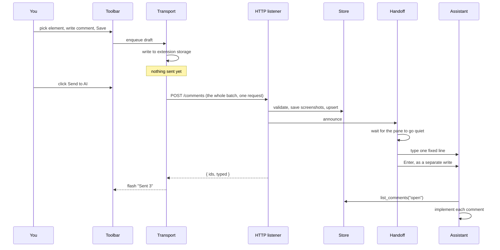
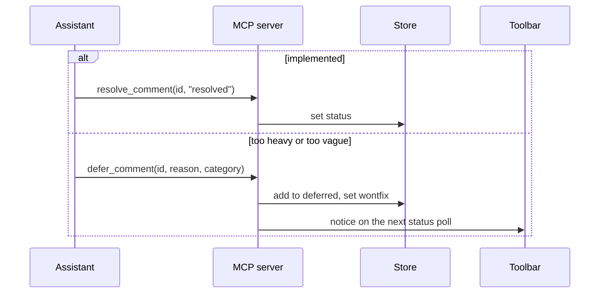
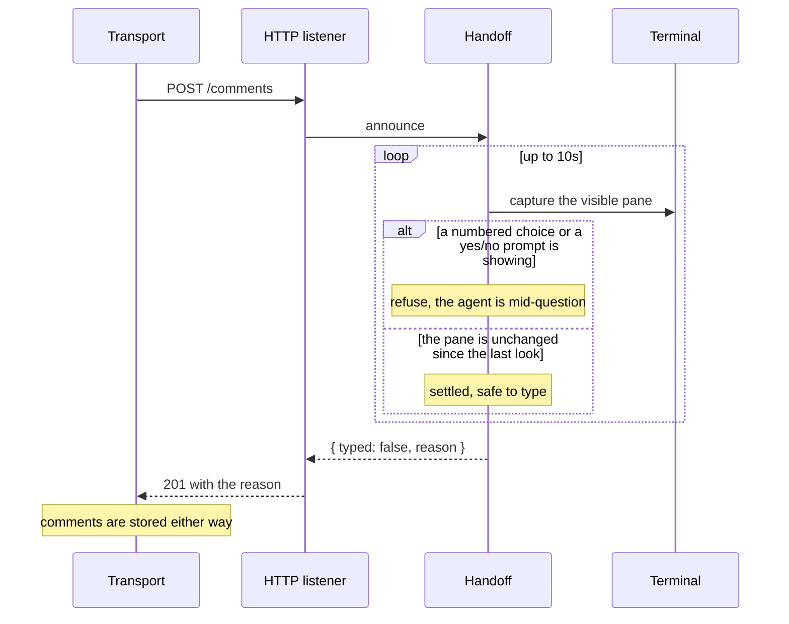

# Flows

These sequence diagrams show the message order for the three things Northstar does:
sending a batch, resolving or deferring work, and the handoff refusing to type. The
participants are the toolbar (in the content script), the extension transport layer,
the server's HTTP listener, the terminal handoff, the comment store, and the AI
assistant.

## 1. Capture a comment and send the batch

Saving a comment is local and instant. Sending is the moment data crosses to the
server and the moment your assistant is told about it.

Save enqueues, Send flushes. A comment that is only saved never reaches the
assistant, which is the single most common reason a batch looks like it was missed.

Batches that land back to back within a few seconds are announced once, because one
line covers every comment still open.

## 2. Resolve or defer

After working through a batch the assistant writes the outcomes back through the MCP
tools.

Deferrals split into two kinds: `needs-plan` for changes that are too heavy to do
inline, and `feedback` for comments too vague to act on. Both leave a notice in the
toolbar so you know they were parked, not dropped.

## 3. The handoff declines to type

The handoff never types blind. If the terminal is showing a choice, your comments
are still saved and the toolbar tells you they were not announced.

The check is positive: it types only once it has seen the pane hold still, rather
than typing unless it recognises trouble.
