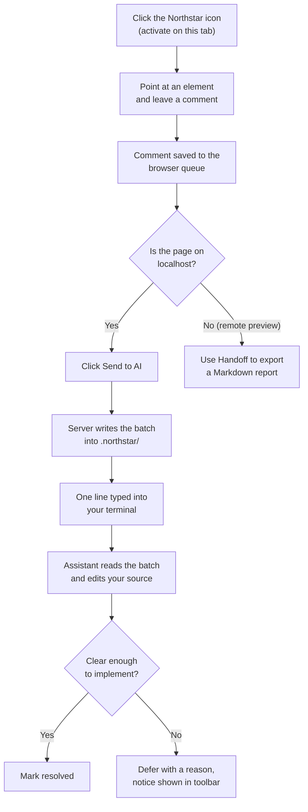
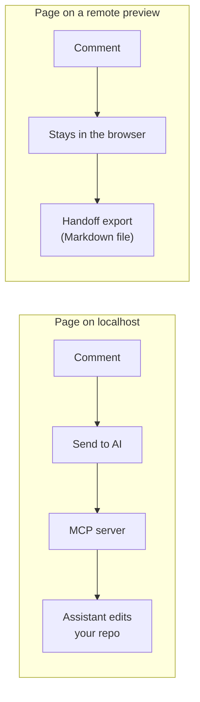

# How Northstar works

Northstar connects three things that normally cannot talk to each other: a web page
in your browser, a comment store on your disk, and an AI coding assistant running in
your terminal. You mark up the running UI, and the assistant closes the marks in the
real source files.

## The short version

You click the Northstar icon to turn it on for the current tab. A small floating
toolbar appears. You point at an element, leave a note (or recolor it, or edit its
text), and the note is pinned to that element. When you are ready, you click **Send
to AI**. Northstar writes the batch to disk and types one line into the terminal your
assistant is already running in, then presses Enter for you.

There is nothing to pair and nothing to paste. Nothing leaves your machine either:
the browser and the server meet on `127.0.0.1`.

## The comment lifecycle

Each saved item carries more than the text you typed. It records a stable selector
for the element, its visible text, a cropped screenshot, the page URL, and, when your
dev build exposes an inspector attribute, an exact `file:line:column` pointer into
the source. That bundle is what lets the assistant find the right code even when the
selector alone would be ambiguous.

## The handoff

There is no supported API for pushing a prompt into a running coding assistant, so
Northstar does what a person would do: it types.

The MCP server is launched by your assistant, which means it inherits the assistant's
environment and can find the terminal underneath it. Three details make this reliable.

**Finding the terminal.** The server is spawned detached, so its own controlling
terminal reads as none. It walks up the process ancestry until it finds one that has
a real terminal device, which is the assistant's. The terminal flavour comes from
environment variables that survive the detach: `TMUX_PANE` for tmux, `TERM_PROGRAM`
for iTerm2 and Terminal.app.

**Waiting for a safe moment.** Before typing anything it reads the visible pane
twice, a quarter second apart, and only proceeds once the two look identical. If it
sees a numbered choice or a yes/no question it refuses outright, because an Enter at
a permission prompt would answer a question you never saw. Your comments are stored
either way and the toolbar tells you they were not announced.

**Pressing Enter separately.** An assistant TUI treats a fast burst of input as a
paste and folds a trailing Enter into the text instead of submitting it. The Enter
goes in as its own write, a fifth of a second later.

Nothing in that path is specific to one assistant. Claude Code, Codex and Gemini all
receive the same keystrokes.

## What gets typed

Always the same fixed line, telling the assistant to read the open comments through
the Northstar MCP tools. Your comment text never goes through the terminal. It is
read from the store by the assistant, and the server instructs it to treat that text
as data describing a UI change rather than as instructions to follow.

## Local pages versus remote previews

Northstar behaves differently depending on where the page is served, because it only
ever edits a local repository.

On a `localhost` dev server the assistant has a real repo to change, so comments flow
straight to the server. On a remote preview there is no local project to edit, so
Northstar keeps the comments in the browser and hands them off as a Markdown file you
can give to any assistant.

## Staying on top of the page

The overlay lives in a closed shadow DOM, and that host is promoted into the browser's
**top layer** with the Popover API. The top layer sits above every stacking context,
so a page cannot hide the comment bubble by bidding higher on `z-index`. Because the
top layer stacks in promotion order, Northstar promotes itself again whenever the page
puts something new up there, and moves inside a page's modal dialog while one is open
so it stays clickable rather than being made inert.
