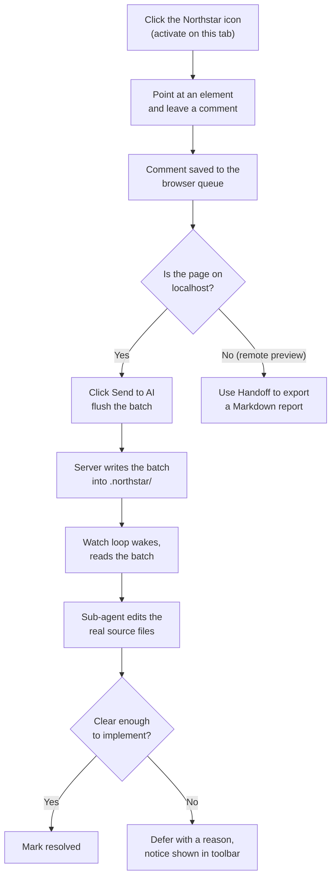
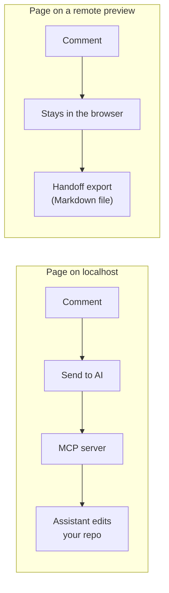

# How Northstar works

Northstar connects three things that normally cannot talk to each other: a web page
in your browser, a comment store on your disk, and an AI coding assistant running
in your terminal. You mark up the running UI, and the assistant closes the marks
in the real source files.

## The short version

You click the Northstar icon to turn it on for the current tab. A small floating
toolbar appears. You point at an element, leave a note (or recolor it, or edit
its text), and the note is pinned to that element. When you are ready, you click
Send to AI. In your editor you paste a one-line watch command once, and from then
on every batch you send is implemented for you and marked done.

Nothing leaves your machine. The browser and the assistant meet on a server that
listens only on `127.0.0.1`.

## The comment lifecycle

Each saved item carries more than the text you typed. It records a stable
selector for the element, its visible text, a cropped screenshot, the page URL,
and, when your dev build exposes an inspector attribute, an exact
`file:line:column` pointer into the source. That bundle is what lets the
assistant find the right code even when the selector alone would be ambiguous.

## Local pages versus remote previews

Northstar behaves differently depending on where the page is served, because it
only ever edits a local repository.

On a `localhost` dev server the assistant has a real repo to change, so comments
flow straight to the server and into the watch loop. On a remote preview there is
no local project to edit, so Northstar keeps the comments in the browser and hands
them off as a Markdown file you can give to any assistant.

## The watch loop

Pairing is a single paste. The browser toolbar shows a watch command; you copy it
into Claude Code once. That binds the session and starts a loop that waits for the
next batch, implements it, and waits again. The loop is event driven, not timed:
the server wakes it the instant a batch syncs, so there is no polling and no blind
window where a sent comment sits unseen. See [Flows](./flows.md) for the exact
message order.

## Scoring a page

Alongside comments, Northstar can rate a whole page. You capture the page, the
server records a rating request, and the assistant scores it for how well it
serves its own purpose (a dashboard is judged as a dashboard, not against a
cinematic landing page). The score comes back as ui, ux, and coherence numbers
with short, actionable advice, and shows up in the toolbar drawer.
